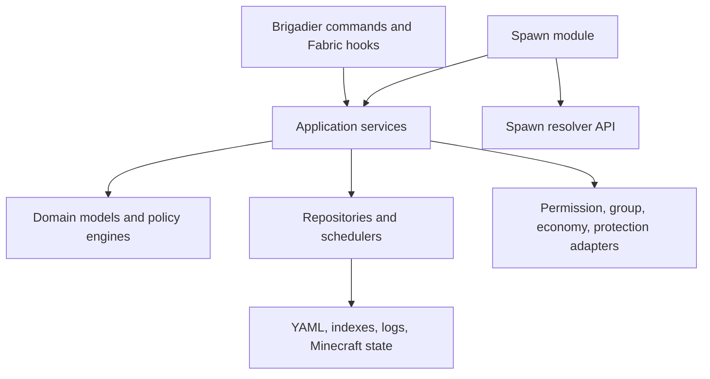
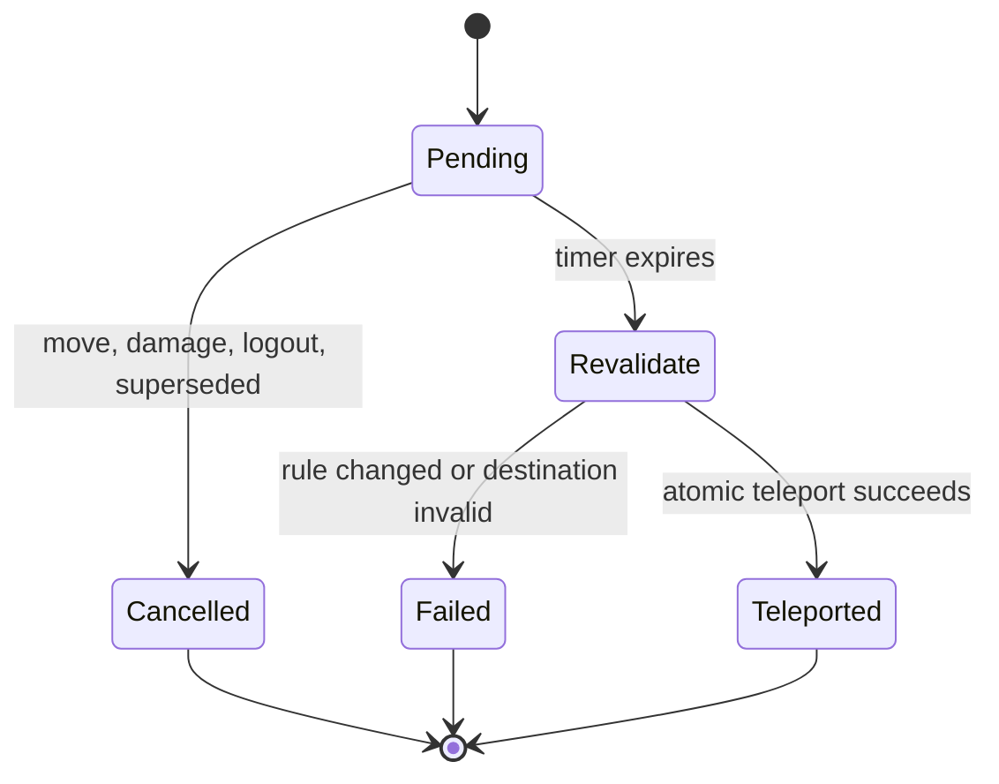
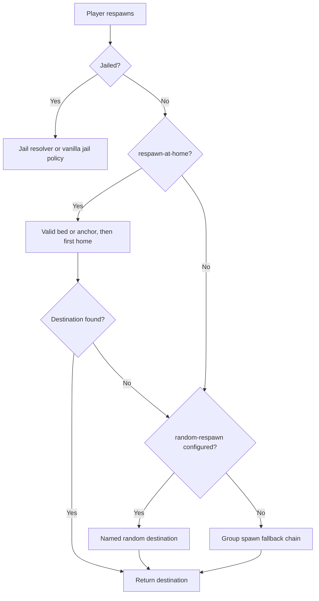

# Essentials for Fabric 1.21.1

## Technical reproduction specification for `Essentials/` and `EssentialsSpawn/`

**Document status:** implementation-ready architecture and parity contract  
**Target game:** Minecraft Java Edition 1.21.1  
**Target platform:** Fabric Loader, dedicated server (server-side mod)  
**Java:** 21  
**Behavioral reference:** EssentialsX 2.22.0 and the `2.x` source branch  
**Included upstream modules:** `Essentials/`, `EssentialsSpawn/`  
**Excluded upstream modules:** AntiBuild, Chat, Protect, Discord, DiscordLink, GeoIP, XMPP  
**Recommended working name:** Essentials Fabric (confirm naming rights before public distribution)

---

## 1. Executive decision

Build a server-side, Fabric-native reimplementation rather than a Bukkit compatibility layer. Preserve EssentialsX's player-facing command names, aliases, permissions, configuration concepts, persisted data, messages, cooldowns, and edge-case behavior wherever Minecraft 1.21.1 permits it. Replace Bukkit services and events with small domain services, Fabric callbacks, Brigadier command trees, and narrowly scoped Mixins.

The result should ship as two logical Fabric mods:

| Artifact | Mod ID | Responsibility |
|---|---|---|
| Core | `essentials_fabric` | Everything represented by upstream `Essentials/` |
| Spawn | `essentials_fabric_spawn` | `/spawn`, `/setspawn`, first-join, join-spawn, and respawn routing from `EssentialsSpawn/` |

`essentials_fabric_spawn` must depend on the exact compatible core API version. A distribution may bundle both JARs, but the source modules and API boundary should remain distinct. Neither mod requires installation on vanilla clients.

This is not a binary port of EssentialsX 2.22.0. That release is a behavioral and data reference; it targets a later server ecosystem and cannot be loaded into a Fabric 1.21.1 server. All registry identifiers, packets, screen handlers, and Mixins must be implemented and verified against Minecraft 1.21.1.

### 1.1 Non-negotiable outcomes

1. Every command declared by the selected upstream modules is implemented, deliberately version-adapted, or recorded as an explicit incompatibility with a tested fallback.
2. Legacy `essentials.*` permission nodes remain authoritative.
3. Existing EssentialsX core and spawn data can be imported without modifying the source installation.
4. Money, inventory, kit, sign, and teleport operations are transactional and cannot duplicate or silently destroy state.
5. User-data disk I/O, profile lookup, chunk lookup, backup processes, and expensive tab-completion work never block the server thread.
6. Vanish, mute, jail, AFK, teleport warmup, keep-inventory, and respawn behavior are enforced at the game-mechanics layer, not merely at command entry points.
7. Permission, group/meta, and protection integrations are adapters. Economy is integrated through Impactor 5.3.5; the mod must not implement Vault emulation or maintain a competing balance ledger.

---

## 2. Scope and parity contract

### 2.1 Included

The core module includes commands and services for:

- player utility, movement, flight, speed, time, weather, healing, feeding, god mode, AFK, and session metadata;
- homes, warps, back locations, teleport requests, direct/offline teleportation, safety, warmups, cooldowns, and random teleportation;
- Impactor-backed economy, balances, payments, worth, sales, command costs, rankings, and transaction logging;
- kits, item creation and editing, recipes, enchantments, potion/firework/book/skull handling, unlimited items, powertools, inventory inspection, and portable workstations;
- private messaging, replies, ignore, social spy, mail, nicknames, MOTD, rules, info, help, and custom text pages;
- bans, IP bans, temporary bans, kicks, mutes, jails, vanish, sudo, destructive administrative commands, server information, weather, and time;
- Essentials signs, including economy, kit, warp, random-teleport, utility, and trade signs;
- join/quit behavior, playtime, last-seen state, sleeping rules, death handling, keep-inventory/XP, and login protections;
- configuration, messages/localization, user data, homes, warps, jails, kits, worth data, random-teleport definitions, command cooldowns, and backups.

The spawn module includes:

- `/spawn [player]` and `/setspawn <group>`;
- group-aware named spawn storage;
- first-join spawn, announcement, and newbie kit;
- configured spawn-on-join behavior;
- respawn-at-home/bed/anchor and group-spawn resolution;
- random first-join and respawn locations.

### 2.2 Explicitly excluded

| Upstream module | Excluded behavior |
|---|---|
| EssentialsChat | Public-chat formatting, local chat radius, shout/question channels, group chat formats |
| EssentialsAntiBuild | Permission-based block/place/use restrictions and alerts |
| EssentialsProtect | Environment protection, block/entity protection, blacklist, physics and spawn rules |
| EssentialsDiscord / DiscordLink | Discord relay, linking, account sync |
| EssentialsGeoIP | IP geolocation |
| EssentialsXMPP | XMPP messaging |

Core `/msg`, `/r`, `/mail`, `/ignore`, `/nick`, `/me`, `/broadcast`, `/helpop`, `/msgtoggle`, `/rtoggle`, and `/socialspy` are included because they belong to `Essentials/`, not EssentialsChat. Essentials signs are likewise included. Configuration keys belonging solely to excluded modules may be recognized during migration, but must be reported as inactive rather than implemented accidentally.

### 2.3 Parity labels

Maintain `parity/essentials-2.22.0.yml` in the source repository. Every upstream command, permission, configuration key, data field, and listener behavior gets one status:

| Status | Meaning |
|---|---|
| `exact` | Same observable result on 1.21.1 |
| `adapted` | Same intent with a documented Fabric/Minecraft difference |
| `optional` | Requires an integration mod or capability |
| `unsupported` | Impossible or intentionally omitted, with justification and fallback |
| `excluded-module` | Belongs outside the two selected modules |

CI must compare the checked-in upstream command/permission manifest to this parity file and reject unclassified additions.

---

## 3. Reference baseline, versioning, and licensing

Use the EssentialsX 2.22.0 release plus an exact commit hash from the `2.x` branch as the initial behavioral baseline. Store both values in `parity/upstream.lock`; never use a moving branch as an unaudited contract. Review newer upstream releases manually and add behavior only after classifying its relevance to Minecraft 1.21.1.

EssentialsX is GPL-3.0 licensed. A source-level port, copied implementation, or derivative distribution must satisfy GPL obligations, including compatible licensing and corresponding source. A clean-room implementation can make an independent licensing choice only if it does not copy protectable code. Command names, compatible data formats, and observed behavior are useful compatibility targets, but public branding should be reviewed separately. Include upstream attribution regardless.

Recommended version policy:

```text
mod version: MAJOR.MINOR.PATCH+mc1.21.1
core API:     semver, independent from config schema
data schema:  monotonically increasing integer
```

Load must fail with a clear message when the spawn module's required core API is unavailable. Data migrations must be forward-only and create a recoverable backup.

---

## 4. Architecture

### 4.1 Gradle modules

```text
essentials-fabric/
├── api/                    stable service interfaces and events
├── core/                   Essentials feature implementation
├── spawn/                  EssentialsSpawn implementation
├── compat/                 optional adapters selected at runtime
├── test-common/            fixtures, fake clock, golden vectors
├── gametest/               Fabric GameTests and dedicated-server tests
├── parity/                 upstream lock, manifests, waivers
└── migration-testdata/     sanitized Bukkit-format fixtures
```

Use Loom and Mojang mappings pinned for 1.21.1. Shade only libraries that are safe to relocate; avoid exposing implementation libraries in the API. The API JAR should contain interfaces, immutable records, result types, and event contracts—never implementation singletons.

### 4.2 Runtime layers



Commands and hooks translate Minecraft objects into immutable domain inputs, invoke services, then render localized results. Rules such as teleport eligibility, payment validity, home limits, jail expiry, or spawn precedence must live in domain services so they can be tested without a running server.

### 4.3 Core services

| Service | Responsibility |
|---|---|
| `UserService` | Async load, session attachment, mutation, snapshot, save, unload |
| `IdentityService` | UUID/name history, async profile resolution, display/nickname lookup |
| `PermissionService` | Permission queries, wildcard/default policy, context |
| `GroupMetaService` | Primary group, memberships, prefix/suffix, numeric/meta values |
| `CommandPolicyService` | Cooldowns, costs, mute/jail restrictions, audit, target exemptions |
| `TeleportService` | Safety, warmup, cooldown, cross-dimension movement, back state |
| `TeleportRequestService` | TPA state machine, expiry, auto-accept, cancellation |
| `HomeService`, `WarpService` | Named destination CRUD and access policy |
| `RandomTeleportService` | Named area definitions, candidate search, async chunk validation |
| `EssentialsEconomyService` | Essentials policy over Impactor accounts, currencies, transactions, ranking, and audit |
| `KitService` | Parse, validate, grant, cooldown, cost, slots, command entries |
| `ItemService` | Registry-aware item parsing/editing and safe serialization |
| `MessagingService`, `MailService` | Private messaging, replies, ignore, spy, persistent mail |
| `AFKService` | Activity tracking, automatic AFK, freeze, pickup/sleep rules |
| `ModerationService` | Ban, mute, kick, jail, exemptions, timed state |
| `VisibilityService` | Vanish visibility graph and packet filtering |
| `SignService` | Sign parsing, validation, permissions, atomic execution |
| `TextPageService` | MOTD/rules/info/custom pages, chapters, pagination, placeholders |
| `ConfigService`, `MessageService` | Typed reloadable config and locale bundles |
| `BackupService` | Save coordination and explicitly configured external backup process |

`EssentialsFabric` may expose a service container, but commands must use constructor injection. Static global state makes reload, tests, and repeated server lifecycle unsafe.

### 4.4 Threading contract

The server thread owns all Minecraft world, entity, inventory, and screen-handler mutations. Repositories may parse and write immutable snapshots on a bounded executor. A typical operation is:

1. Capture or load non-world data asynchronously.
2. Return to the server executor.
3. Revalidate player connection, revision, permission, balance, inventory, and destination.
4. Apply the atomic world/domain change.
5. Queue a durable snapshot and audit record.

Never retain a `ServerPlayer`, `ServerLevel`, entity, container, command source, or registry lookup outside the server thread. Backpressure is mandatory: bound queues, coalesce repeated user saves, expose queue depth, and reject optional work before exhausting memory.

---

## 5. Fabric platform mapping

### 5.1 Baseline dependencies

| Dependency | Policy |
|---|---|
| Minecraft 1.21.1 | Exact supported game line |
| Java 21 | Required runtime/toolchain |
| Fabric Loader | Pin minimum tested version |
| Fabric API | Pin an exact 1.21.1 build in release metadata |
| Fabric Permissions API | Recommended soft dependency; operator fallback without it |
| LuckPerms Fabric | Optional group, prefix/suffix, and meta adapter |
| Impactor 5.3.5 for 1.21.1 | Required runtime economy implementation and ecosystem API |
| WorldEdit Fabric | Optional command/item interoperability; no hard coupling needed for core parity |
| Protection provider | Optional `ActionPolicy` adapter, including a future WorldGuard Fabric mod |

Fabric Permissions API answers permission checks but is not a complete group/meta API. Do not infer groups from permission node strings. Use a dedicated `GroupMetaService`, preferably backed by LuckPerms when present, with deterministic defaults otherwise.

There is no Vault requirement or compatibility shim. Use [Impactor](https://modrinth.com/mod/impactor) as the authoritative Fabric economy service. Impactor supplies a built-in service, supports multiple currencies, and permits its service implementation to be replaced for ecosystem interoperability. Essentials Fabric adds Essentials-specific policy and commands over that API; it does not store a second authoritative balance in userdata.

Compile the economy adapter against the requested 5.3.5 API:

```kotlin
repositories {
    maven("https://maven.impactdev.net/repository/development")
}

dependencies {
    implementation("net.impactdev.impactor.api:economy:5.3.5")
}
```

Do not shade or relocate Impactor API classes into the Essentials JAR. Install the Impactor 1.21.1 server mod and declare its actual mod ID/version as a required dependency in `fabric.mod.json`; confirm that ID from the pinned distribution during implementation. The linked `1.20.1` source is useful historical reference, but the build and runtime must pin Impactor's `1.21.1` branch/release line. Modrinth classifies Impactor as dedicated-server-only, so this specification adopts that deployment boundary. Startup must fail clearly if Impactor is absent, below 5.3.5, exposes no `EconomyService`, or has no primary/configured currency.

### 5.2 Lifecycle

- Register config codecs, repositories, services, and adapters from `ModInitializer`.
- Register Brigadier commands through `CommandRegistrationCallback`.
- Load global files during server-starting; validate before accepting players.
- Attach a user-load future as early as the connection lifecycle permits. Join handling waits on it without blocking the server thread.
- Drive expiry queues and activity state from server ticks; never scan all stored users every tick.
- On disconnect, cancel live requests and tasks, snapshot the user, and unload only after the write is queued.
- On server stop, reject new mutations, drain writes with a configurable timeout, then emit a loud error if durability cannot be confirmed.

### 5.3 Mixins policy

Prefer public Fabric callbacks. A Mixin is justified when a callback cannot cancel or alter the relevant result, especially respawn placement, vanish packet visibility, login gates, inventory/XP drops, chat/command interception, and some sign or item interactions. Every critical Mixin must:

- target an exact 1.21.1 descriptor under the chosen mappings;
- use the narrowest injection point and document invariants;
- fail loudly during startup if it no longer applies;
- have a GameTest or dedicated-server integration test;
- avoid overwriting whole vanilla methods.

---

## 6. Configuration and persistence

### 6.1 Filesystem layout

```text
config/essentials-fabric/
├── config.yml
├── messages/
│   ├── messages_en.properties
│   └── messages_<locale>.properties
├── userdata/<uuid>.yml
├── usermap.csv
├── warps/<warp>.yml
├── jails.yml
├── kits.yml
├── kits/*.yml
├── worth.yml
├── tpr.yml
├── spawn.yml
├── motd.txt
├── rules.txt
├── info.txt
├── custom.txt
├── logs/
│   ├── economy.log
│   ├── commands.log
│   └── migration.log
└── migrations/
```

Use YAML compatibility for administrator-facing files and imported userdata. Parse into typed immutable records; commands never traverse raw YAML. Preserve unknown keys on round-trip where practical. Reject invalid configuration atomically: the active configuration remains in service and the administrator receives file, path, value, and expected type.

### 6.2 User identity and data

UUID is canonical. Names are mutable aliases stored in a case-folded index with history and last-seen timestamps. Profile resolution is asynchronous and may resolve UUID literals directly. Never call a network/profile cache synchronously from command execution.

Each user record needs at least:

| Domain | Fields |
|---|---|
| Identity | UUID, current name, previous names, nickname |
| Economy | selected Impactor currency ID and migration/import marker; no authoritative balance |
| Destinations | homes, last location, logout location, last death/back location |
| Time | login/logout, last teleport/heal/activity/AFK, playtime |
| Moderation | jailed location/name/expiry, mute expiry/reason, vanish, god mode |
| Communication | ignored UUIDs, reply target and expiry, spy/msg/pay/reply toggles |
| Player state | AFK, flight, fly/walk speed, personal time/weather |
| Features | kit-use timestamps, command cooldowns, unlimited materials, powertools |
| Mail | sender UUID/name snapshot, body component source, sent/read/expiry |

Store locations as `LocationRef(dimension ResourceKey, x, y, z, yaw, pitch)`. A migration-only resolver maps Bukkit world UUID/name to a Fabric dimension key. No persisted record holds a live world object.

### 6.3 Durable writes

Every mutable aggregate has a revision. Saving captures a snapshot at revision *n*, encodes it off-thread, writes to a sibling temporary file, flushes it, and atomically replaces the destination. If a newer revision appears during the write, queue one additional save. Use a single ordered writer per repository or key-affine locking so two snapshots cannot reorder.

Impactor owns account durability. Essentials keeps an append-only operation/audit journal for multi-resource operations such as `/sell`, kits, command costs, and signs. Each entry contains an idempotency key, Impactor currency, accounts, amount, reason, actor, inventory/state revision, result, and timestamp. Player-to-player movement must use Impactor's account-to-account `transfer` transaction, never a hand-written withdraw followed by deposit. Recovery must reconcile pending inventory/economy operations without applying money twice.

### 6.4 Reload

`/essentials reload` reloads messages, text pages, kits, worth, TPR definitions, and reload-safe configuration. It must not replace executors, the bound Impactor service/currency, serializer registries, or Mixins. A reload is two-phase: parse/validate a candidate snapshot, then swap it atomically. Report keys requiring restart. Changing the Impactor currency requires a restart and an explicit balance-migration operation.

---

## 7. Permissions, groups, and command policy

### 7.1 Permission resolution

Preserve all `essentials.*` nodes and wildcard semantics. Resolution order:

1. Explicit external permission-provider result.
2. Context-sensitive provider result for dimension/world when supported.
3. Vanilla operator/default policy configured by the mod.
4. Deny.

Do not silently grant every command to non-operators when no provider exists. A configurable `player-commands` list can grant selected safe commands to ordinary players. Console and command blocks require explicit sender-capability rules; many player-only commands must fail cleanly rather than fabricate a user.

Common permission patterns include:

| Family | Examples |
|---|---|
| Command | `essentials.home`, `essentials.pay`, `essentials.kit` |
| Other target | `essentials.balance.others`, `essentials.spawn.others` |
| Exemption | `essentials.mute.exempt`, `essentials.teleport.timer.bypass` |
| Notification | `essentials.kick.notify`, `essentials.ban.notify` |
| Offline | `essentials.pay.offline`, `essentials.tpoffline` |
| Object scope | `essentials.warps.<name>`, `essentials.kits.<name>` |
| Item scope | `essentials.itemspawn.item-<id>`, `essentials.give.item-<id>` |
| World scope | `essentials.worlds.<dimension-or-alias>` |
| Capability | `essentials.fly.safelogin`, `essentials.vanish.see` |

Generate the complete permission catalog from upstream `plugin.yml` and ship it in `parity/permissions.yml`; this document specifies families but is not a substitute for that machine-readable inventory.

### 7.2 Group/meta bridge

`GroupMetaService` exposes memberships, primary group, prefix, suffix, and typed meta. Home limits, sell multipliers, spawn groups, nickname prefixes, and display formatting query this service. The no-provider adapter returns primary group `default`, no decorations, and configuration defaults. Cache provider results briefly and invalidate on provider events.

Spawn lookup should test the primary group first to match normal Essentials deployment expectations. If an administrator wants inherited-group order, expose a deterministic configuration option; never depend on an unordered set.

### 7.3 Shared command pipeline

Every command passes through:

```text
source validation → permission → target resolution → exemption check
→ mute/jail/command restriction → cooldown/warmup → cost confirmation
→ domain operation → localized result → audit
```

Costs are debited only after all preconditions pass and immediately before a commit that can be rolled back. Cooldowns are recorded after success unless the upstream behavior specifically consumes on attempt. Audit sensitive commands without logging private mail/message contents or IP addresses unless separately enabled.

---

## 8. Teleportation kernel

All teleporting commands, homes, warps, jails, back, TPR, and spawn must call one `TeleportService`. Direct calls to vanilla teleport APIs outside that service are forbidden.

### 8.1 Request model

```java
public record TeleportIntent(
    UUID actor,
    UUID subject,
    Destination destination,
    TeleportCause cause,
    SafetyMode safety,
    boolean preservePassengers,
    boolean updateBackLocation,
    String permissionContext
) {}
```

The service validates dimension availability, world border, build height, chunk readiness, hazards, vehicle/passenger state, combat/config restrictions, jail, protection providers, warmup, cooldown, and target visibility. It returns structured failures, not message strings.

### 8.2 Safety resolver

For standing destinations require:

- solid/supporting floor unless flight/special cause permits otherwise;
- two passable body blocks and an appropriate collision shape;
- no lava, fire, campfire, cactus, powder snow, suffocation, void, or configured hazardous block;
- coordinate inside the world border and legal build height;
- a loaded or asynchronously loadable chunk;
- protection adapter approval for the cause.

Search outward deterministically within configured horizontal and vertical bounds. Respect Nether ceiling/floor peculiarities and dimension-specific coordinate scales. Never silently select an unsafe fallback. `essentials.teleport.safety.bypass` may skip environmental checks but not dimension existence or finite-coordinate validation.

### 8.3 Warmup state machine



Movement uses configurable squared distance and may optionally ignore view rotation. Damage cancellation is evaluated after invulnerability/god cancellation so a denied hit does not necessarily cancel. Revalidate everything at completion. Use a monotonic tick deadline rather than wall-clock timers.

### 8.4 Back state

Capture the subject's origin only after a teleport commits. Death location is separately eligible for `/back` according to configuration and `essentials.back.ondeath`. Failed teleports never overwrite a valid back location. Cross-dimension back coordinates retain dimension keys and orientation.

### 8.5 Teleport requests

Model TPA requests by requester, recipient, direction (`TO_TARGET` or `HERE`), creation tick, expiry, and request ID. Enforce one active pair policy, request timeout, cooldown, deny/cancel, auto-accept, target teleport toggle, ignore, vanish visibility, and `tpaall` fan-out limits. `/tpaccept [player]` must handle ambiguity deterministically. Disconnect, reload, mute/jail policy changes, or a completed request removes it.

### 8.6 Random teleport

`tpr.yml` stores named destinations with dimension, center, minimum and maximum range, excluded biomes, and search limits. Candidate search may run asynchronously, but world inspection occurs through server-safe chunk futures. Respect the world border and use 1.21.1 heightmaps in the Overworld; scan legal standing positions in the Nether and nonstandard dimensions.

Default to ten candidate attempts and cache safe points only if definitions and relevant chunks have not changed. If all attempts fail, return failure. An optional `legacy-center-fallback` may reproduce the risky historical center fallback but must default off.

---

## 9. Homes, warps, jails, and destinations

### 9.1 Homes

Homes are per-user, case-insensitive named `LocationRef` values preserving display spelling. Implement default-home selection, `bed` handling, other-player syntax (`player:home`), rename, deletion, list pagination, and location safety. Home count is selected by:

1. `essentials.sethome.multiple.unlimited`;
2. highest configured `sethome-multiple` rank for which the user has `essentials.sethome.multiple.<rank>`;
3. default limit.

Concurrent `/sethome` calls must serialize per user. If a world/dimension is unavailable, retain the home and report it unavailable; never delete automatically.

### 9.2 Warps

Store one atomic file per warp to reduce write contention. Names are case-insensitive. Support list pagination, hidden/inaccessible warps, per-warp permissions (`essentials.warps.<warp>`), other-player teleport, overwrite policy, `warpinfo`, configured sort order, and world permission checks. Tab completion must filter by permission and vanish rules.

### 9.3 Jails

`jails.yml` maps names to destinations. Jailing a player stores jail name, release instant, prior location policy, and reason if available. Enforce jail by movement/teleport hooks and command restrictions, not only `/home`. Timed jail expiry uses a priority queue and is also checked on login. `/togglejail` must safely jail offline users, release online/offline users, and reject targets with exemption permissions. A released player goes to the configured prior, spawn, or safe fallback destination.

---

## 10. Economy through Impactor

### 10.1 Authority and adapter boundary

Impactor 5.3.5 is the authoritative economy API and storage/service owner. Essentials Fabric must resolve `net.impactdev.impactor.api.economy.EconomyService`, obtain an Impactor `Currency`, and fetch/create UUID-owned `Account` objects through the service's future-returning account API. It must not introduce `EconomyProvider`, Vault, or an Essentials-owned balance column.

The local `EssentialsEconomyService` is an application adapter, not a provider:

```java
public interface EssentialsEconomyService {
    CompletionStage<MoneyView> balance(UUID owner);
    CompletionStage<EssentialsTransactionResult> transfer(
        UUID from, UUID to, BigDecimal amount, OperationContext context);
    CompletionStage<EssentialsTransactionResult> mutate(
        UUID owner, BalanceMutation mutation, OperationContext context);
    CompletionStage<List<RankedBalance>> top(BalanceQuery query);
}
```

Internally it delegates to Impactor's `EconomyService`, `CurrencyProvider`, `Account`, `EconomyTransaction`, and `EconomyTransferTransaction`. This wrapper adds Essentials permissions, limits, confirmation, messages, rankings, audit IDs, and coordination with inventories; it must preserve Impactor transaction results rather than reducing them to a Boolean.

### 10.2 Currency selection

EssentialsX presents one server currency, while Impactor supports multiple. Add:

```yaml
economy:
  impactor-currency: primary # or the exact Impactor currency identifier
```

At server start, resolve `primary` through `EconomyService.currencies().primary()` or resolve the configured identifier through the currency provider. Bind the result for the lifetime of the server. All Essentials balances, payments, command costs, kits, signs, worth values, and rankings use that same currency. An unknown currency is a startup configuration error, not a fallback to another ledger.

Use Impactor's `BigDecimal` values directly. Normalize command input to the selected currency's supported precision/format rules and never pass `double`. Essentials minimum/maximum balance, loans, starting balance, minimum payment, and display formatting must be reconciled with the selected Impactor currency:

- Impactor/currency constraints are hard limits.
- Essentials may impose a stricter limit before submitting a transaction.
- `essentials.eco.loan` allows a negative result only when the bound Impactor service/currency supports it; otherwise report that the provider rejected the operation.
- `/eco reset` calls `Account.reset()` so the Impactor currency's starting balance remains authoritative. If Essentials config specifies a different reset value, call `Account.set(BigDecimal)` and document that choice.

### 10.3 Asynchronous account access

`EconomyService.account(currency, uuid)` is future-returning and may perform I/O. Resolve both accounts asynchronously, then continue on the correct executor. Once an `Account` future completes, the Impactor 5.x account transaction methods return transaction reports directly; do not assume that calling deprecated `depositAsync`, `withdrawAsync`, `transferAsync`, or `balanceAsync` makes the operation safer. Pin 5.3.5 and compile with deprecation warnings enabled so a future Impactor 6 migration is visible.

Offline players are ordinary UUID account owners. Creating an account during a read must follow Impactor semantics and Essentials configuration. `/balance <offline>` should not require loading Essentials userdata merely to query money.

### 10.4 Atomic operations

- `/pay` resolves two accounts in the same selected currency and calls `from.transfer(to, amount)`. Impactor's transfer transaction validates withdrawal and deposit together; never implement it as separate `withdraw` and `deposit` calls.
- `/eco give|take|set|reset` calls the corresponding account `deposit`, `withdraw`, `set`, or `reset` operation and records Impactor's result type, actor, target, before/after view, and reason.
- `/sell` validates and reserves the exact inventory snapshot, computes worth and group multiplier, submits an Impactor deposit, then finalizes item removal. If finalization fails after a successful deposit, run a compensating Impactor transaction and quarantine the operation for reconciliation if compensation fails.
- Command costs, kit costs, and sign purchases use the same reservation/journal protocol. A successful Impactor withdrawal is not enough to declare success until the paired Minecraft mutation commits.
- Sign trades involving two player accounts use Impactor transfer. Server-shop signs may use a configured virtual/server account or explicit source/sink semantics; document which model is active.
- Duplicate packets, retries, and recovery replay use an Essentials operation UUID. Since the Impactor 5.x transaction interfaces do not expose an idempotency key in the inspected API, Essentials must serialize operations per involved account set and keep a durable result journal around cross-system commits.

Never hold the server thread waiting on an account future or on provider storage. Inventory reservation/finalization runs on the server thread; Impactor account loading and persistence remain on the API/service's completion path.

### 10.5 Balance top and command ownership

Impactor provides a basic economy and `/baltop`, but Essentials parity still requires `/balance` and `/balancetop` with Essentials aliases, permissions, exclusions, formatting, pages, and visibility rules. Configure the deployment so overlapping Impactor commands are disabled when Impactor offers that option. If they cannot be disabled, command registration must detect collisions at startup, preserve explicit namespaced forms, and fail with an actionable configuration message rather than silently allowing load order to choose behavior.

Build `/balancetop` from `EconomyService.accounts(selectedCurrency)` or a maintained async snapshot, then apply Essentials exclusions, forced display, limits, and vanished/hidden policy. Never enumerate and sort every account on the server thread. Cache the ranking for a configurable interval and invalidate it after relevant successful Essentials transactions; transactions initiated by other mods may require Impactor events or time-based refresh.

### 10.6 Feature parity

Implement `/balance`, `/balancetop`, `/eco`, `/pay`, `/paytoggle`, `/payconfirmtoggle`, `/sell`, `/setworth`, and `/worth`; formatted and exact amounts; offline payments when permitted; multiple-recipient payments when permitted; confirmation thresholds; payment toggles; worth lookup by hand/item/inventory; bulk sale; loans subject to Impactor constraints; rank-based sell multipliers; Impactor currency singular/plural formatting; and append-only Essentials operation logging with configurable retention.

Add integration tests against the actual Impactor 5.3.5 1.21.1 server mod, not only a mock. Include concurrent double-spend attempts: version 5.3.5 contains an upstream race-condition fix related to payment processing, so the release must pin at least that version and must not reintroduce a race in the Essentials wrapper.

---

## 11. Kits, items, inventories, and workstations

### 11.1 Registry-aware item model

On 1.21.1, parse namespaced item IDs and encode complete `ItemStack` state with Minecraft's registry-aware codecs/NBT/component representation. Accept legacy Essentials material aliases through an explicit migration table. Preserve unknown modded item payloads as opaque migration data and report them; do not silently substitute air.

Unsafe enchantments, oversized stacks, illegal potion levels, skull textures, written books, firework data, names/lore, unbreakable state, and colors require distinct permissions and bounds. Text inputs support legacy color codes for compatibility, then convert to safe `Component` values.

### 11.2 Kits

Kit names are lowercase identifiers with display labels. Support:

- delay in seconds; `-1` means one-time;
- `essentials.kits.<kit>`, other-player grants, permission/cost/cooldown bypass;
- item entries with quantity, components, enchantments, name/lore, books, skulls, potions, and fireworks;
- command entries with player-name/display-name placeholders;
- targeted slot entries and optional auto-equip behavior;
- configurable drop-at-feet behavior when inventory is full;
- per-kit cost and atomic rollback;
- `/createkit`, `/delkit`, `/showkit`, `/kit`, `/kitreset`;
- import/export to `kits.yml` and optional split kit files.

Validate a kit completely at load. A failing command entry must follow a configured transaction policy: either prevalidated best-effort or strict rollback for all reversible item/economy changes. Never run kit commands with unrestricted server authority unless the configuration explicitly marks them as console commands.

The EssentialsSpawn newbie kit bypasses normal cost, permission, and cooldown exactly as upstream. Record its one-time grant separately so join retries do not duplicate it.

### 11.3 Workstations and inventory views

Portable anvil, cartography, grindstone, loom, smithing table, stonecutter, and workbench commands open correct server-owned 1.21.1 screen handlers. Disposal is a nonpersistent container whose contents are destroyed on close. `invsee` and ender-chest editing require authoritative containers, slot validation, synchronization, and disconnect/teleport cleanup. Offline editing is allowed only through a serialized user-inventory repository with exclusive locks; otherwise report it unsupported.

### 11.4 Unlimited items and powertools

Unlimited items restore the consumed/placed stack after a successful action, respecting exclusions for damageable, stateful, container, or configured materials. It needs hooks for use, placement, projectile consumption, bucket changes, and inventory mutation; a periodic stack top-up is not sufficient and creates duplication bugs.

Powertools bind commands to an item type and action modes such as left/right use. Dispatch through the normal command service so permissions, cooldowns, costs, jail/mute policy, and auditing still apply. Rate-limit invocation and prevent recursive powertool execution.

---

## 12. Messaging, text, nicknames, and AFK

### 12.1 Private communication

Implement `/msg`, `/r`, `/ignore`, `/msgtoggle`, `/rtoggle`, `/socialspy`, `/mail`, `/me`, `/broadcast`, `/broadcastworld`, and `/helpop`. The message service must enforce ignore state, ignore exemptions, vanished visibility, recipient message toggle, sender mute, reply timeout, reply-to-vanished policy, message rate limits, and spy rules.

Social spy observes configured commands and private-message metadata. It must never bypass staff hierarchy accidentally; require the spy permission and an explicit rule for hidden/vanished participants. Mail supports read, clear, send, temporary mail, send-all, expiry, unread notification, offline users, and send rate limits. Store sender UUID plus a name snapshot.

This scope does not format public chat. If another chat mod is installed, expose mute and AFK metadata APIs and use the available chat cancellation callback, but do not reproduce EssentialsChat channel/radius formatting.

### 12.2 Text and components

Use native Minecraft `Component` as the internal rendered representation. Administrators may configure legacy `&`/`§` codes and, optionally, MiniMessage-like syntax through a bundled and pinned text adapter. Gate colors, RGB, formatting, magic, URLs, and multiple-recipient messaging with the corresponding permissions. Sanitize click events so configuration cannot produce unintended command execution.

`motd.txt`, `rules.txt`, `info.txt`, `custom.txt`, and book-style files support chapters, pages, keywords, permission-aware sections, pagination, placeholders, and locale fallback. Cache parsed documents by file revision.

### 12.3 Nicknames and identity presentation

Support nickname set/reset/others, prefix behavior, regex and blacklist rules, maximum visible length, formatting permissions, reset-on-username-change, operator coloring, real-name lookup, and optional tab-list/display integration. Prefix/suffix values come from `GroupMetaService`. Do not promise client-side nameplate replacement that requires client mods; document whether the implementation changes chat components, tab-list display, or server-side custom names.

### 12.4 AFK

Track meaningful activity from movement beyond tolerance, interaction, attack, item use, chat/command, fishing, and inventory actions. Support manual/custom-message/other-player AFK, automatic timeout, optional kick or command action, broadcast/list display, AFK name marker, pickup disabling, sleep-percentage exclusion, frozen players, temporary protection, and configurable AFK cancellation actions.

Freeze enforcement must correct position without rubber-band spam, block push/vehicle bypass, and coexist with teleport warmups. If temporary god mode is added for AFK, preserve and restore the user's prior god state rather than blindly disabling it.

---

## 13. Moderation, visibility, join, and death

### 13.1 Bans, kicks, mutes, and sudo

Use vanilla user/IP ban lists and whitelist as authoritative where compatible. Timed bans store an expiry and are checked both by vanilla list expiration and the mod's login policy. Support offline profiles, reasons, source, exemptions, notifications, `/ban`, `/tempban`, `/banip`, `/tempbanip`, `/unban`, `/unbanip`, `/kick`, `/kickall`, `/mute`, and explicit `/unmute`.

Mute persists by UUID and blocks configured communication paths: private messages, mail sends, `/me`, selected commands, and public chat when a cancellation hook is available. `/unmute` must be a first-class Brigadier literal for current parity. Exemptions are checked against the target and cannot be bypassed by aliases.

`/sudo` executes through the same server command dispatcher with a clearly modeled effective source. It may simulate a player's command, but must never synthesize arbitrary packet input or bypass permission checks unless a separate dangerous permission explicitly authorizes console execution.

### 13.2 Vanish

Vanish is a visibility graph, not merely invisibility. For each observer/subject pair, decide visibility using `essentials.vanish.see` and hierarchy policy. Filter:

- entity spawn, metadata, movement, equipment, passengers, sounds, and removal packets;
- player-list/tab entries and command suggestions;
- `/list`, `/near`, `/seen` online state, reply targets, join/quit messages;
- pickup, collisions, targeting, sleeping counts, advancements/death broadcasts;
- teleport request and messaging discovery.

Support vanish effect, interaction, pickup, and other-player nodes. Resynchronize observers on permission changes, join, world change, respawn, vanish toggle, and provider reload. Test an observer matrix of ordinary user, staff without see, staff with see, operator, console, and self.

### 13.3 Join and session behavior

Implement custom join/quit and username-change messages, silent join/quit, MOTD delay, unread mail, last login/logout, playtime, last location, login attack delay, safe flight login, full-server bypass, whitelist bypass, sleeping-ignore for AFK/vanished players, and first-join determination.

Full-server and whitelist bypass Mixins may override only those capacity/list checks after authentication has succeeded. They must not weaken encryption, session verification, bans, or profile validation.

### 13.4 Death and respawn contributions

Core records death/back location and handles `essentials.keepinv`, `essentials.keepxp`, curse policies, death-coordinate messages, and configured death-message visibility. Capture/drop mutation must occur exactly once in the death pipeline and respect gamerules according to documented precedence. Spawn module then contributes a respawn destination; it does not own inventory or XP policy.

---

## 14. Essentials signs

Included sign families:

| Category | Sign types |
|---|---|
| Economy | Balance, Buy, Sell, Trade, Free |
| Destinations | Warp, RandomTeleport |
| Player state | Gamemode, Heal, Time, Weather |
| Items/services | Enchant, Repair, Kit, Spawnmob, Mail, Info |
| Workstations | Anvil, Cartography, Disposal, Grindstone, Loom, Smithing, Workbench |

Creation, use, and breaking require per-type permission nodes plus color/format/magic permissions. Normalize line text and recognize bracketed names case-insensitively. Validation at sign-edit time resolves referenced kit, warp, material, enchantment, amount, price, and destination; invalid signs remain ordinary signs with a useful error.

Sign use is rate-limited and passes through protection, economy, inventory, cooldown, and audit services. Buy/sell/trade operations use exact inventory snapshots and atomic economic mutation. A trade sign with stored inventory must persist its owner and stock in block-entity-associated mod data or a chunk-keyed repository, with locks and orphan cleanup. Breaking a valid Essentials sign is protected and safely returns or settles stored stock according to configured policy.

Use Fabric block-use and sign-edit hooks where possible; otherwise apply narrow Mixins to 1.21.1 sign update/use paths. Do not depend on EssentialsProtect. Instead, call the generic `ActionPolicy` SPI so a protection mod may approve creation, use, or break.

---

## 15. EssentialsSpawn exact behavior

### 15.1 Storage and commands

`spawn.yml` maps lowercase group names to `LocationRef` records. `/setspawn <group>` (alias `/esetspawn`) requires `essentials.setspawn`; `/spawn [player]` (alias `/espawn`) requires `essentials.spawn`, with `essentials.spawn.others` for another player.

Group-spawn lookup is:

1. requested/primary group spawn;
2. `default` spawn;
3. vanilla spawn of the first loaded Overworld/NORMAL-equivalent dimension;
4. vanilla spawn of the first loaded dimension;
5. structured failure if no server world exists.

Resolve a safe standing position through the shared teleport kernel. Retain invalid or unavailable configured spawns and diagnose them; never overwrite with fallback merely because a dimension is temporarily absent.

### 15.2 Configuration

Preserve these EssentialsSpawn concepts:

| Key | Meaning |
|---|---|
| `newbies.announce-format` | First-join broadcast; empty disables |
| `newbies.spawnpoint` | Named group spawn for first join |
| `newbies.kit` | First-join kit granted without normal cost/permission/cooldown |
| `spawn-on-join` | Boolean, group string, or list of groups |
| `respawn-at-home` | Prefer home chain before group spawn |
| `respawn-at-home-bed` | Permit valid bed as preferred home |
| `respawn-at-anchor` | Permit charged respawn anchor when applicable |
| `random-spawn-location` | Named TPR definition for first join |
| `random-respawn-location` | Named TPR definition for respawn |
| `respawn-listener-priority` | Migration hint; mapped to resolver ordering |
| `spawn-join-listener-priority` | Migration hint; mapped to join resolver ordering |

Fabric has no Bukkit listener priority contract. Expose ordered `JoinDestinationResolver` and `RespawnDestinationResolver` APIs with numeric priority and terminal/nonterminal decisions. Parse legacy priority strings only to choose a default relative order and report the translation.

### 15.3 Join sequencing

User-data load and first-join determination must complete before Spawn behavior is scheduled. Do not infer first join merely from an empty Fabric session object.

For an existing player, if `spawn-on-join` matches the configured boolean/group/list and the player lacks `essentials.spawn-on-join.exempt`, teleport to the group spawn using join teleport policy.

For a first join:

1. Resolve a configured random spawn if present; otherwise resolve `newbies.spawnpoint` after the player exists in a world.
2. Revalidate and teleport on the next server tick.
3. Broadcast the newbie announcement if configured.
4. Grant the newbie kit after the player inventory is initialized, using an idempotent grant marker.

Short tick delays are lifecycle coordination, not arbitrary wall-clock sleeps.

### 15.4 Respawn precedence



Bed and anchor validation must use vanilla ownership/charge/dimension rules. A failed random search falls through only according to explicit configuration; default to group spawn rather than an unsafe random center. Inject before vanilla final respawn placement is committed, then permit higher-priority third-party resolvers to veto or replace through the API.

---

## 16. Complete command surface

Aliases and exact descriptions must be generated from the locked upstream `plugin.yml`; the tables below define the required primary literals and behavior areas. Every literal needs Brigadier syntax, help text, permission, console policy, target policy, tab completion, localization, and tests.

### 16.1 Player and session utility

| Commands | Required behavior |
|---|---|
| `afk`, `playtime`, `seen`, `whois` | Activity/session state, offline lookup, privacy permissions |
| `compass`, `depth`, `getpos`, `near`, `ping` | Position/direction/proximity/latency with vanish filtering |
| `fly`, `speed`, `god` | Self/other state, login/world-change persistence, bounds |
| `heal`, `feed`, `ext`, `ice`, `rest`, `suicide` | Health/hunger/fire/freeze/sleep/death rules and cooldowns |
| `gamemode`, `world` | Safe mode/dimension transitions with other-target permissions |
| `ptime`, `pweather` | Per-player reset/set behavior |
| `time`, `weather`, `thunder` | World-scoped state with all-world option |
| `list`, `gc` | Filtered online list and server/runtime diagnostics |

### 16.2 Destinations and teleportation

| Command | Core syntax/behavior |
|---|---|
| `back` | Return to prior teleport/death location |
| `home` | `[player:][home]` |
| `sethome`, `delhome`, `renamehome` | Named home CRUD, self/other policy |
| `warp`, `warpinfo`, `setwarp`, `delwarp` | Warp use/list/info/CRUD |
| `tp`, `tphere`, `tpo`, `tpohere` | Normal and override direct teleports |
| `tpall` | Teleport all eligible online players to the sender or specified player, with per-target policy and batching |
| `tppos` | `<x> <y> <z> [yaw] [pitch] [dimension]` |
| `tpoffline` | Teleport to stored offline logout location |
| `tpa`, `tpahere`, `tpaccept`, `tpdeny`, `tpacancel`, `tpauto`, `tpaall` | Request lifecycle |
| `tptoggle` | Incoming teleport toggle, self/other |
| `top`, `bottom`, `jump` | Safe ray/column destination operations |
| `tpr`, `settpr` | Named random teleport and definition editing |
| `spawn`, `setspawn` | Spawn module commands |

`tpo` and related override forms bypass player teleport toggles and request flow, not fundamental coordinate validation or protection policy unless separately authorized.

### 16.3 Economy

| Command | Core syntax/behavior |
|---|---|
| `balance` | `[player]`, exact/formatted permissions |
| `balancetop` | `[page]`, async ranking and exclusions |
| `eco` | `<give|take|set|reset> <player> <amount>` |
| `pay` | `<player> <amount>`, offline/multiple/confirm rules |
| `paytoggle`, `payconfirmtoggle` | Self/other payment preferences |
| `sell` | Hand/item/inventory/bulk sale |
| `setworth`, `worth` | Registry item worth editing/query |

### 16.4 Kits, items, and inventory

| Commands | Required behavior |
|---|---|
| `kit`, `createkit`, `delkit`, `showkit`, `kitreset` | Full kit lifecycle |
| `item`, `give`, `more`, `itemdb` | Registry-aware spawning/query with item permissions |
| `enchant`, `itemname`, `itemlore`, `potion`, `firework`, `book`, `skull`, `spawner` | Component/NBT-aware editing |
| `repair`, `condense`, `hat`, `unlimited` | Inventory transformations and safety |
| `clearinventory`, `clearinventoryconfirmtoggle`, `disposal` | Destructive confirmation and target policy |
| `invsee`, `enderchest` | Online/offline authoritative inventory views |
| `exp` | Give/set/query levels or points |
| `recipe` | Registry recipe lookup/pagination |
| `powertool`, `powertoollist`, `powertooltoggle` | Bound command actions |
| `anvil`, `cartographytable`, `grindstone`, `loom`, `smithingtable`, `stonecutter`, `workbench` | Portable vanilla screen handlers |

### 16.5 Communication and information

| Commands | Required behavior |
|---|---|
| `msg`, `r`, `msgtoggle`, `rtoggle` | Private messages and reply state |
| `ignore`, `socialspy` | UUID-based ignore and staff observation |
| `mail` | `read`, `clear`, `send`, `sendtemp`, `sendall` |
| `nick`, `realname` | Nickname lifecycle and resolution |
| `broadcast`, `broadcastworld`, `me`, `helpop` | Component output and sender policy |
| `motd`, `rules`, `info`, `customtext`, `help` | Paginated text/help |

### 16.6 Moderation and administration

| Commands | Required behavior |
|---|---|
| `ban`, `tempban`, `unban`, `banip`, `tempbanip`, `unbanip` | Vanilla-backed lists, expiry, offline targets |
| `kick`, `kickall`, `kill`, `burn`, `mute`, `unmute` | Exemptions, reason/duration, notifications |
| `setjail`, `jails`, `jailedplayers`, `togglejail` | Jail CRUD and enforcement |
| `vanish` | Packet-level self/other visibility |
| `sudo` | Controlled command dispatch |
| `essentials` | Version, diagnostics, safe reload |
| `backup` | Opt-in external process with save coordination |
| `remove` | Entity category/radius/dimension removal with limits |

### 16.7 World actions and novelty commands

| Commands | Required behavior |
|---|---|
| `antioch`, `beezooka`, `fireball`, `kittycannon`, `lightning`, `nuke` | Projectile/explosion/lightning effects with limits |
| `bigtree`, `tree` | Feature placement with space/protection validation |
| `break` | Targeted block break through protection policy |
| `spawnmob` | `<entity>[:data][,<mount>[:data]] [amount] [player]` with registry allowlist |
| `editsign` | Server-authoritative sign line editing and revalidation |

These commands are included for parity but should default to operators, enforce configurable entity/explosion/count limits, honor protection adapters, and produce an audit record. No command may use unrestricted SNBT/entity data without a dangerous permission and strict parser limits.

---

## 17. Permission coverage requirements

In addition to every primary command node, implement the upstream granular families. At minimum the generated catalog must cover:

- homes: `home.others`, `sethome.others`, `sethome.multiple`, `.multiple.<rank>`, `.multiple.unlimited`, deletion/rename of others;
- warps: `.list`, `.others`, `warps.<warp>`, overwrite, world access;
- kits: `.others`, `.exemptdelay`, `kits.*`, `kits.<kit>`, unsafe item attributes;
- economy: balance others, top force/exclude, loan, offline/multiple payment, sell hand/inventory/bulk and `sell.multiplier.<rank>`;
- teleport: timer/cooldown/safety bypass, hidden targets, world permissions, offline, others, exemptions, TPA variants;
- vanish: self/others/see/effect/interact/pickup;
- death: `keepinv`, `keepxp`, `back.ondeath`;
- join: full-server and whitelist bypass, silent join/quit, sleeping ignored;
- messaging: color/format/RGB/URL/multiple, ignore exemptions, social-spy variants;
- item spawning: `item-all`, `item-<id>`, give/unlimited equivalents, unsafe enchantment and oversized-stack nodes;
- signs: `signs.create.<type>`, `signs.use.<type>`, `signs.break.<type>`, color/format/magic;
- spawn: `essentials.spawn`, `essentials.spawn.others`, `essentials.setspawn`, `essentials.spawn-on-join.exempt`;
- moderation: target exemptions, offline targeting, notifications, IP visibility, higher-staff restrictions.

Permission checks must be made at operation time, not only at command-tree visibility. Aliases, signs, powertools, kits, and API callers route through identical authorization.

---

## 18. Fabric hooks and Mixins map

| Behavior | Preferred hook | Mixin fallback / target area |
|---|---|---|
| Commands | `CommandRegistrationCallback` | Command pre-execution only for global policy/spy |
| Join/disconnect | Fabric networking/lifecycle callbacks | Player-list connection lifecycle |
| Server tick | Server tick events | None |
| Damage/god/AFK/login guard | Server living-entity damage callback | Damage method cancellable injection |
| Chat mute/activity | Server message callback | 1.21.1 chat packet handler |
| Movement warmup/jail/AFK | Tick sampling plus teleport callbacks | Movement packet handler for immediate cancellation |
| Block/item/entity use | Fabric interaction callbacks | Specific vanilla action where callback lacks result |
| Signs | Block use and sign change hooks | Sign update/use handler |
| Death keep inventory/XP | Death/drop callbacks if complete | `ServerPlayer` death/drop pipeline |
| Respawn destination | Spawn resolver API | Player-list respawn before position commit |
| Vanish | No complete public hook | Entity tracker and player-list packet send paths |
| Full/whitelist bypass | Login events if cancellable | Capacity/whitelist checks only |
| Portable workstations | Vanilla screen handlers | None expected |
| Fly/speed persistence | Join, respawn, world-change hooks | Server-player dimension transition |
| Unlimited items | Use/place/inventory callbacks | Specific consumption paths |
| Command cooldown/cost/mute/jail | Command service wrapper | Dispatcher interception for non-Essentials configured commands |

Maintain `mixin-audit.json` containing target class, method descriptor, purpose, expected invocation count, test ID, and failure severity. Startup diagnostics should report all applied critical Mixins.

---

## 19. Public API and integrations

### 19.1 Stable API

Expose Fabric entry points or a versioned service lookup for:

- read-only user state and safe mutations;
- Essentials economy policy and transaction results backed by Impactor (do not expose a second provider);
- teleport intents, preflight, completion, and cancellation;
- home/warp/spawn lookup without leaking mutable repositories;
- vanish visibility queries;
- mute, jail, AFK, nickname, and ignore state;
- join and respawn destination resolvers;
- action/protection policy;
- locale-aware message rendering.

Events should be structured and cancellable only where cancellation is meaningful. Do not expose configuration implementation types or allow callers to mutate a `UserData` object directly.

### 19.2 WorldEdit Fabric

WorldEdit is not required by EssentialsX core behavior, but administrators commonly use both. Integrate lightly:

- accept WorldEdit/Fabric world identifiers through the normal dimension resolver;
- preserve WorldEdit command registration and do not claim its aliases;
- optionally allow selection-derived center/range convenience for `/settpr`, behind a soft adapter;
- route destructive Essentials commands through `ActionPolicy`, not through WorldEdit internals;
- keep WorldEdit absence a normal supported state.

### 19.3 Protection integration

```java
public interface ActionPolicy {
    Decision test(ActionContext context);
}
```

Contexts include actor, subject, dimension, position/region, action type, cause, and relevant item/entity. Actions cover teleport enter/exit, sign create/use/break, block break/tree placement, entity spawn/remove, explosions, lightning, fire, inventory drops, and random destination acceptance. Combine providers with deny-overrides semantics and a timeout/failure policy that defaults to safe denial for destructive operations.

---

## 20. Migration from Bukkit EssentialsX

Provide `/essentials migrate plan|apply|status` and an offline CLI. The importer reads a copy or explicit path such as `plugins/Essentials`, never mutates it.

### 20.1 Migration phases

1. Inventory files, versions, UUID/name records, worlds, item identifiers, locales, and unknown keys.
2. Build an administrator-approved world mapping from Bukkit world name/UUID to Fabric dimension key.
3. Parse configs and classify excluded-module keys.
4. Convert users, homes, warps, jails, kits, worth, TPR, spawn, text pages, and mail into a staging directory.
5. Produce counts, warnings, conflicts, unresolved profiles/worlds/items, and hashes.
6. On approval, atomically activate the staged data and retain a dated backup.

### 20.2 Conversion rules

- Prefer UUID filename identity; use usermap/name history only for missing links.
- Stage balances exactly as decimal strings, then import them into the selected Impactor currency through account `set` transactions. Record source value, Impactor result, and destination account; never leave the authoritative imported balance in Essentials userdata.
- Preserve unavailable destinations with unresolved-world status.
- Map legacy material/enchantment/entity aliases through a versioned table; recognize namespaced mod IDs.
- Convert legacy text formatting to source text that round-trips without losing intent.
- Convert timestamps explicitly with timezone/units recorded.
- Preserve unknown fields under a migration extension namespace and log them.
- Detect case-insensitive home/warp/kit collisions and require a deterministic rename decision.
- Do not import data belonging solely to excluded modules.

Migration is idempotent: the same source hash and options yield the same staged result. Store a manifest with source hashes and schema versions.

---

## 21. Security, correctness, and performance

### 21.1 Security

- Treat all command, sign, kit, text, SNBT, file-path, and configuration input as untrusted.
- Bound string length, nested component/SNBT depth, entity counts, radius, mail recipients, tab completion results, and page sizes.
- Resolve paths beneath configured roots; reject traversal and symlink escape.
- Do not log private messages, mail bodies, IPs, or full serialized items by default.
- Rate-limit expensive or abusive commands per sender and globally.
- External backup execution is disabled by default. Use an executable plus argument array, no shell interpolation, allowlisted path, timeout, captured logs, and server-save coordination.
- Never let whitelist/full-server bypass weaken authentication or bans.
- Validate packet-derived state again on the server thread.

### 21.2 Correctness invariants

- A payment never debits without crediting or crediting back.
- A kit/sign/sell transaction never both retains items and grants value after failure.
- A failed teleport never changes back state or consumes a successful-use cooldown/cost unless explicitly configured.
- Exactly one respawn destination wins.
- User writes cannot reorder revisions.
- A vanished user is either visible or hidden consistently for a given observer across entity, tab, commands, and services.
- First-join kit and announcement are idempotent across disconnect/retry.
- Reload cannot expose a partially parsed configuration.

### 21.3 Performance budgets

Set measurable budgets on a representative dedicated server:

| Operation | Budget |
|---|---|
| Cached permission/user read | no allocation-heavy disk/network work on tick |
| Tick maintenance | sub-millisecond at 100 online players under normal load |
| Command dispatch excluding async completion | normally below 2 ms |
| User save | zero server-thread file I/O |
| Balance top | async, bounded memory, paginated result |
| TPR | bounded attempts/chunk futures, cancellable on logout |
| Vanish resync | batched to avoid packet spikes |

Expose diagnostic counters: loaded users, dirty snapshots, write queue depth/age, active teleport warmups/requests, TPR searches, permission cache hit rate, economy recovery state, and Mixin status.

---

## 22. Testing strategy

### 22.1 Unit and property tests

- decimal parsing, formatting, min/max, two-account conservation, retries, concurrent transfers;
- teleport request state transitions and expiry with a fake clock;
- safety resolver hazard/collision/world-border/build-height matrices;
- home-limit group/meta selection and concurrent set-home;
- kit delay, one-time, slot, cost, full-inventory, and rollback behavior;
- command cooldown/cost sequencing;
- mail expiry, ignore, reply timeout, and vanish recipient policy;
- mute/jail/ban expiry and restart restoration;
- spawn fallback and respawn precedence;
- YAML round-trip, unknown-key preservation, and migration idempotency;
- text component parsing and permission-gated formatting.

Use property tests for economy conservation, serializer round-trip, destination finite coordinates, and arbitrary invalid input.

### 22.2 GameTests and dedicated-server tests

- execute every command as player, operator, console, command block where applicable, online target, and offline target;
- verify aliases call the same policy path;
- cross-dimension teleports, movement/damage cancellation, passengers, chunk failure, and back state;
- first join, ordinary join, spawn-on-join exemption, group fallback, bed/anchor/home/random/group respawn;
- item component preservation, modded registry IDs, kit auto-equip, full inventory, sign transactions, and workstation close/dupe cases;
- keep inventory/XP under gamerules and curse combinations;
- vanish observer matrix across join, respawn, world change, permission change, tab list, suggestions, and messages;
- full server/whitelist bypass without ban/auth bypass;
- TPR borders, excluded biomes, Nether, unloaded chunks, cancellation;
- shutdown with dirty saves and crash-recovery transaction replay.

### 22.3 Golden parity suite

Run scripted scenarios against a Paper server using the locked EssentialsX baseline and the Fabric implementation. Normalize colors, timestamps, UUIDs, and version-dependent component serialization. Compare command success/failure, state changes, persistence, permission outcomes, and message semantic keys. Store intentional 1.21.1/Fabric differences as reviewed waivers with rationale—not ad hoc test exclusions.

### 22.4 Release gates

A release candidate fails if:

- a command, alias, permission, config key, or selected-module behavior is unclassified;
- excluded-module behavior is accidentally implemented or required;
- a critical Mixin is unapplied;
- server-thread file/network I/O appears in profiling;
- any economy, inventory, kit, sign, or workstation duplication test fails;
- vanish leaks in the required observer matrix;
- migration changes its source or cannot be safely repeated;
- dirty data cannot drain or recover;
- dedicated-server smoke tests do not pass on Java 21 / Minecraft 1.21.1.

---

## 23. Implementation roadmap

### Milestone 0 — Contract and foundation

- Lock upstream commit/release and generate command/permission/config manifests.
- Establish Gradle modules, Java 21, Fabric 1.21.1 CI, API conventions, fake clock, message keys.
- Implement typed config, atomic repositories, user identity/index, permission/group adapters, command pipeline, diagnostics.
- Prove async load/save and clean shutdown under fault injection.

### Milestone 1 — Basic core utility

- Brigadier registration/help/aliases and source/target abstraction.
- Session/user commands, health/food/fire/freeze, flight/speed/god, position/time/weather.
- Join/quit, MOTD/text pages, playtime/seen, basic nickname/display.

### Milestone 2 — Destination platform

- Teleport kernel, safety, warmup/cooldown, back.
- Homes, warps, direct/override/offline teleport, TPA state machine.
- TPR and destination policy SPI.

### Milestone 3 — Economy, kits, and items

- Impactor 5.3.5 adapter, currency binding, rankings, payments, worth/sell, command costs, and cross-system journal.
- Registry-aware item parser/serializer, kits, item editing, recipes, unlimited items, powertools.
- Workstations, disposal, inventory/ender-chest inspection.

### Milestone 4 — Communication and moderation

- Messaging, replies, ignore, social spy, mail, AFK.
- Ban/IP/temp-ban, kick, mute/unmute, jails, sudo.
- Packet-complete vanish and join/death enforcement.
- Backup and destructive/novelty commands with hardening.

### Milestone 5 — Signs and Spawn module

- All core sign types with transactional economy/inventory behavior.
- Spawn storage/commands, first-join flow, join routing, respawn resolver, newbie kit.
- Third-party resolver and protection APIs.

### Milestone 6 — Migration and parity hardening

- Full EssentialsX importer and reports.
- Golden Paper/Fabric parity suite and reviewed waivers.
- Load/performance/soak/fault tests, localization audit, operator documentation.
- Release candidate only after all parity entries and release gates pass.

Do not postpone persistence, permissions, concurrency, or API boundaries until after feature work; nearly every command depends on them.

---

## 24. Definition of done

The reproduction is complete when a developer or server administrator can:

1. Install the core and optional spawn JARs on a clean Fabric 1.21.1 server with vanilla clients.
2. Configure the selected EssentialsX behavior using familiar keys or documented translations.
3. Use every primary command in Section 16 and its locked upstream aliases under the correct permission and sender conditions.
4. Run homes, warps, teleports, TPA, TPR, economy, kits, items, messaging, mail, AFK, moderation, vanish, jails, signs, joins, deaths, and spawn/respawn without Bukkit.
5. Integrate Fabric permission/group, Impactor economy, WorldEdit, and protection mods through the documented adapters.
6. Dry-run and apply an import from an EssentialsX core/spawn installation with a complete discrepancy report.
7. Restart or crash-recover without lost half-transactions, stale timers, duplicate newbie kits, or corrupted userdata.
8. Audit a generated matrix proving that every selected upstream command, permission, configuration key, persisted field, and listener behavior is exact, adapted, optional, or explicitly unsupported.

---

## 25. Key risks and required decisions

| Risk/decision | Recommended resolution |
|---|---|
| EssentialsX 2.22.0 is newer than MC 1.21.1 | Use it as behavior reference only; bind runtime code to 1.21.1 and record semantic waivers |
| Large permission surface | Generate manifests from upstream; never maintain only by hand |
| No Vault on Fabric | Require Impactor 5.3.5; delegate accounts/currencies/transactions and keep only Essentials policy/journal state |
| Impactor and Essentials both expose balance-top commands | Disable overlapping Impactor commands where supported; otherwise detect collision and require an explicit command policy |
| Essentials is single-currency while Impactor is multi-currency | Bind one configured Impactor currency at startup; changing it requires restart and migration |
| Groups are not permissions | Separate `GroupMetaService`; optional LuckPerms adapter |
| Packet-complete vanish is brittle | Central visibility graph, narrow audited Mixins, observer-matrix tests |
| Respawn APIs differ from Bukkit priorities | Ordered resolver API; translate legacy priority keys as migration hints |
| Item data changed substantially | Use 1.21.1 registry-aware ItemStack codec/components; retain raw unknown migration data |
| Offline inventory mutation can corrupt saves | Ship only with exclusive authoritative serializer/lock; otherwise restrict to online |
| Shell backup command is dangerous | Disabled by default, executable/args allowlist, no shell, timeout and audit |
| Faithful fun/admin commands can grief | Operator defaults, limits, confirmation, protection policy, audit |
| Exact source reuse triggers GPL obligations | Decide clean-room versus GPL derivative before implementation and document provenance |

---

## 26. Source and implementation references

### EssentialsX primary sources

- [EssentialsX repository](https://github.com/EssentialsX/Essentials)
- [`Essentials/` module on `2.x`](https://github.com/EssentialsX/Essentials/tree/2.x/Essentials)
- [`EssentialsSpawn/` module on `2.x`](https://github.com/EssentialsX/Essentials/tree/2.x/EssentialsSpawn)
- [Core command and permission manifest (`plugin.yml`)](https://github.com/EssentialsX/Essentials/blob/2.x/Essentials/src/main/resources/plugin.yml)
- [Core default configuration (`config.yml`)](https://github.com/EssentialsX/Essentials/blob/2.x/Essentials/src/main/resources/config.yml)
- [Spawn command and permission manifest](https://github.com/EssentialsX/Essentials/blob/2.x/EssentialsSpawn/src/main/resources/plugin.yml)
- [EssentialsX 2.22.0 release](https://github.com/EssentialsX/Essentials/releases/tag/2.22.0)
- [GPL-3.0 license](https://github.com/EssentialsX/Essentials/blob/2.x/LICENSE)

### Fabric and Minecraft implementation references

- [Fabric documentation: creating commands](https://docs.fabricmc.net/develop/commands/basics)
- [Fabric documentation: events](https://docs.fabricmc.net/develop/events)
- [Fabric documentation: saved data](https://docs.fabricmc.net/develop/saved-data)
- [Fabric API repository](https://github.com/FabricMC/fabric)
- [Fabric Loader repository](https://github.com/FabricMC/fabric-loader)
- [Fabric Permissions API](https://github.com/lucko/fabric-permissions-api)
- [LuckPerms](https://github.com/LuckPerms/LuckPerms)
- [WorldEdit repository](https://github.com/EngineHub/WorldEdit)
- [Impactor on Modrinth](https://modrinth.com/mod/impactor)
- [Impactor 1.21.1 source branch](https://github.com/NickImpact/Impactor/tree/1.21.1)
- [Impactor 1.21.1 Economy API source snapshot](https://github.com/NickImpact/ImpactorAPI/tree/dbcce5b992bfb6f94e82f2f3b60e81f61ae4cc2e/economy/src/main/java/net/impactdev/impactor/api/economy)

Before coding, pin exact commits/versions of all build dependencies and verify every named hook and Mixin descriptor against the 1.21.1 mappings used by the project.

---

## Appendix A — Required machine-readable parity record

```yaml
upstream:
  repository: https://github.com/EssentialsX/Essentials
  release: 2.22.0
  commit: <exact-2.x-commit>
target:
  minecraft: 1.21.1
  java: 21
modules:
  include: [Essentials, EssentialsSpawn]
  exclude:
    - EssentialsAntiBuild
    - EssentialsChat
    - EssentialsProtect
    - EssentialsDiscord
    - EssentialsDiscordLink
    - EssentialsGeoIP
    - EssentialsXMPP
entries:
  - id: command.home
    source: Essentials/src/main/resources/plugin.yml
    status: exact
    tests: [command-home-self, command-home-other, home-unsafe]
  - id: config.respawn-listener-priority
    source: EssentialsSpawn
    status: adapted
    note: mapped to ordered Fabric respawn resolver
    tests: [spawn-resolver-order]
```

## Appendix B — Teleport completion pseudocode

```java
CompletionStage<TeleportResult> request(TeleportIntent intent) {
    return preflight(intent).thenCompose(plan -> {
        if (plan.failed()) return completedFuture(plan.failure());
        return warmupScheduler.await(plan).thenCompose(unused ->
            serverExecutor.submit(() -> {
                Validation validation = revalidate(plan);
                if (!validation.allowed()) return validation.failure();

                LocationRef origin = capture(intent.subject());
                TeleportResult result = minecraftTeleport(plan);
                if (result.success() && intent.updateBackLocation()) {
                    userService.setBackLocation(intent.subject(), origin);
                }
                if (result.success()) commandPolicy.recordSuccess(intent.actor(), intent.cause());
                audit(result, intent);
                return result;
            })
        );
    });
}
```

The real implementation must also release reservations, cancel chunk futures on disconnect where possible, and make cost/cooldown updates part of the operation's commit protocol.

## Appendix C — Suggested data schema envelope

```yaml
schema: 3
revision: 184
identity:
  uuid: 00000000-0000-0000-0000-000000000000
  name: Example
  nameHistory: []
economy:
  impactorCurrency: primary
  import:
    source: null
    completedAt: null
homes:
  home:
    dimension: minecraft:overworld
    x: 0.5
    y: 64.0
    z: 0.5
    yaw: 0.0
    pitch: 0.0
moderation:
  mutedUntil: null
  jail: null
session:
  lastLogin: 0
  lastLogout: 0
  playtimeTicks: 0
extensions: {}
```

Schema envelopes, migration metadata, and unknown-field preservation let the implementation evolve without making administrator data disposable.
